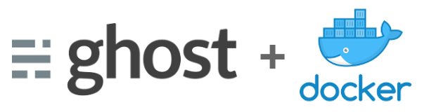

# Ghost base

A Dockerized environment ready for developing and deploying Ghost applications.



## Development environment

```
ghost-base $ docker-compose up dev
Creating ghostbase_dev_1 ...
Creating ghostbase_dev_1 ... done
Attaching to ghostbase_dev_1
dev_1   | [2017-08-08 17:58:04] INFO Creating table: posts
dev_1   | [2017-08-08 17:58:04] INFO Creating table: users
dev_1   | [2017-08-08 17:58:04] INFO Creating table: roles
dev_1   | [2017-08-08 17:58:04] INFO Creating table: roles_users
dev_1   | [2017-08-08 17:58:04] INFO Creating table: permissions
dev_1   | [2017-08-08 17:58:04] INFO Creating table: permissions_users
dev_1   | [2017-08-08 17:58:04] INFO Creating table: permissions_roles
dev_1   | [2017-08-08 17:58:04] INFO Creating table: permissions_apps
dev_1   | [2017-08-08 17:58:04] INFO Creating table: settings
dev_1   | [2017-08-08 17:58:04] INFO Creating table: tags
dev_1   | [2017-08-08 17:58:04] INFO Creating table: posts_tags
dev_1   | [2017-08-08 17:58:04] INFO Creating table: apps
dev_1   | [2017-08-08 17:58:04] INFO Creating table: app_settings
dev_1   | [2017-08-08 17:58:04] INFO Creating table: app_fields
dev_1   | [2017-08-08 17:58:04] INFO Creating table: clients
dev_1   | [2017-08-08 17:58:04] INFO Creating table: client_trusted_domains
dev_1   | [2017-08-08 17:58:04] INFO Creating table: accesstokens
dev_1   | [2017-08-08 17:58:04] INFO Creating table: refreshtokens
dev_1   | [2017-08-08 17:58:04] INFO Creating table: subscribers
dev_1   | [2017-08-08 17:58:04] INFO Creating table: invites
dev_1   | [2017-08-08 17:58:04] INFO Creating table: brute
dev_1   | [2017-08-08 17:58:04] INFO Model: Post
dev_1   | [2017-08-08 17:58:05] INFO Model: Tag
dev_1   | [2017-08-08 17:58:05] INFO Model: Client
dev_1   | [2017-08-08 17:58:05] INFO Model: Role
dev_1   | [2017-08-08 17:58:05] INFO Model: Permission
dev_1   | [2017-08-08 17:58:05] INFO Model: User
dev_1   | [2017-08-08 17:58:06] INFO Relation: Role to Permission
dev_1   | [2017-08-08 17:58:07] INFO Relation: Post to Tag
dev_1   | [2017-08-08 17:58:07] INFO Relation: User to Role
dev_1   | [2017-08-08 17:58:07] INFO Finished database migration!
dev_1   | [nodemon] 1.11.0
dev_1   | [nodemon] to restart at any time, enter `rs`
dev_1   | [nodemon] watching: /var/lib/ghost/content/themes/**/*
dev_1   | [nodemon] starting `node current/index.js`
dev_1   | [2017-08-08 17:58:13] INFO Ghost is running in development...
dev_1   | [2017-08-08 17:58:13] INFO Listening on: 0.0.0.0:2368
dev_1   | [2017-08-08 17:58:13] INFO Url configured as: http://localhost:2368/
dev_1   | [2017-08-08 17:58:13] INFO Ctrl+C to shut down
dev_1   | [2017-08-08 17:58:13] INFO Ghost boot 5.415s
```

Your Ghost blog will now be running on [http://localhost:2367/](http://localhost:2367/). Enjoy.

## Production environment

> Work in progress

## License

This project is licensed under the [MIT License](LICENSE).